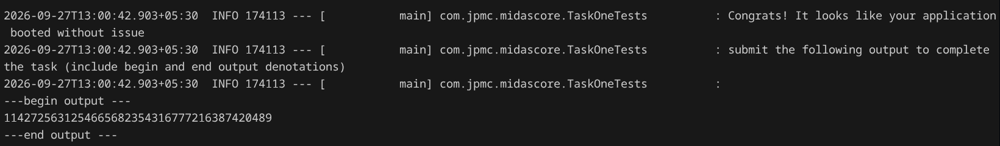
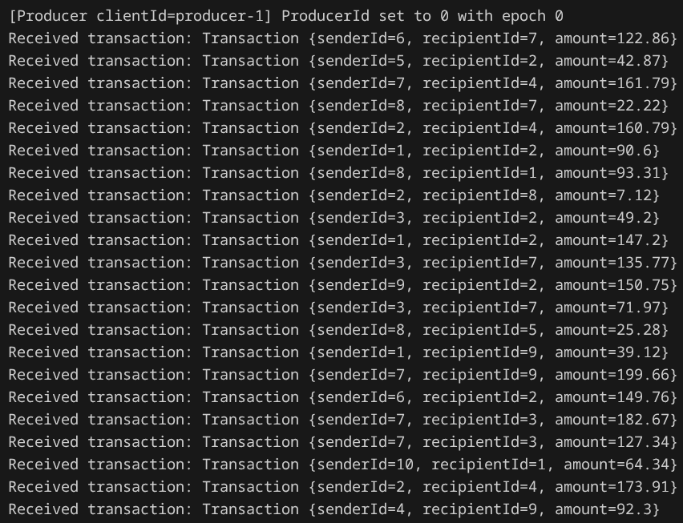

# Midas Core

Project repo for the JPMC Advanced Software Engineering Forage program.

## Overview
This project is a Spring Boot application named **Midas Core** that processes financial transactions using Kafka, stores user records and balances in an in-memory database, and exposes a REST API to query these balances. The project is structured as a set of tasks that progressively build out the application's functionality.

## Architecture
The application follows an event-driven microservice architecture:
- **Event Streaming**: Uses Apache Kafka to stream incoming financial transactions in real-time.
- **Data Persistence**: Uses an in-memory relational database (H2) mapped via Spring Data JPA to maintain user states and account balances safely.
- **REST API**: Exposes endpoints to allow external clients to query current user balances.
- **External Integration**: Integrates with a third-party `transaction-incentive-api` to fetch contextual transaction incentives before completing a transaction.

## Technologies
- **Java 17**
- **Spring Boot 3.x**
- **Spring Kafka** (for event-driven transaction consumption)
- **Spring Data JPA & Hibernate** (for ORM and database interactions)
- **H2 Database** (In-memory database)
- **JUnit 5 & Mockito** (for testing)

## What I Implemented
- **Kafka Listener Setup**: Configured and implemented a Kafka consumer to listen for incoming JSON-serialized transaction messages from a dedicated topic.
- **Transaction Processing Logic**: Built the core logic to validate transactions, verify sufficient funds, and atomically update sender and recipient balances.
- **Incentive API Integration**: Integrated an external mock service (`transaction-incentive-api.jar`) to calculate and apply dynamic incentives to valid transactions.
- **RESTful API**: Developed a REST Controller to expose a `GET /balance` endpoint that returns real-time user balances.

## Important Engineering Decisions
- **Event-Driven Processing**: Opted for a Kafka-based consumer to handle transactions asynchronously, allowing the system to scale and handle high-throughput bursts of transactions without blocking.
- **Data Consistency**: Ensured transaction processing is atomic by wrapping DB updates within `@Transactional` boundaries, preventing partial updates (e.g., deducting from sender but failing to add to recipient).
- **Separation of Concerns**: Kept the Kafka listener, business processing logic, and data access layers strictly separate to maintain clean code and testability.

## What I Learned
- Integrating Apache Kafka into a Spring Boot application and configuring consumer properties.
- Debugging asynchronous, event-driven architectures.
- Managing database state and ensuring transactional integrity in financial applications.
- Testing Kafka pipelines using `EmbeddedKafka` and Spring Boot test utilities.

## Screenshots



## Project Structure
The project has a standard Maven Java structure:
- **`src/main/java`**: Contains the application code.
  - `MidasCoreApplication.java`: The main Spring Boot entry point.
  - `component/DatabaseConduit.java`: Component to interact with the database repository.
  - `entity/UserRecord.java`: JPA entity representing a user (id, name, balance).
  - `foundation/Transaction.java` & `Balance.java`: POJOs representing transaction and balance data.
  - `repository/UserRepository.java`: Spring Data CRUD repository for users.
- **`src/test/java`**: Contains test files that define the tasks and verify completion.
- **`services/`**: Contains an external mock service `transaction-incentive-api.jar` used in the later tasks.

## Tasks Breakdown

### Task 1: Application Initialization
Verified by `TaskOneTests`. The goal is simply to ensure the Spring Boot application initializes and boots up without any issues.

### Task 2: Kafka Consumer
Verified by `TaskTwoTests`. Transactions are pushed to a Kafka topic. The task requires setting up a Kafka listener within `Midas Core` to consume these incoming transactions. You'll use your debugger to intercept the transactions and capture the output.

### Task 3: Processing Transactions
Verified by `TaskThreeTests`. Once transactions are consumed from Kafka, they must be processed. This involves validating sender/receiver, checking if the sender has enough balance, and updating the respective balances in the database via the `UserRepository`. The test asks to find the final balance of a specific user.

### Task 4: Integrating with External API
Verified by `TaskFourTests`. You will run and integrate with the `transaction-incentive-api.jar` provided in the `services/` directory. This API calculates incentives for transactions, which must be added to the balances during transaction processing. 

### Task 5: Exposing a REST API
Verified by `TaskFiveTests`. Create a REST Controller that exposes a GET endpoint at `/balance` to query a user's balance by their `userId`. The application needs to run on port `33400` as expected by `BalanceQuerier`.

## Setup and Running
You can start the application using your IDE or via the Maven wrapper:
```bash
./mvnw spring-boot:run
```

To run a specific task test:
```bash
./mvnw test -Dtest=TaskOneTests
```
